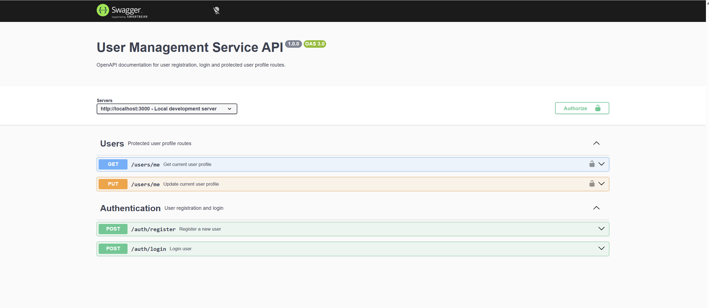

# User Management Service


A lightweight REST API for user registration, login, JWT authentication and protected user profile management.

---

## About the Project

User Management Service is a backend service built with Node.js, Express, MongoDB and JWT.

The project demonstrates a clean authentication flow with user registration, password hashing, login, JWT token generation and protected user profile routes.

It follows a modular backend structure using controllers, routes, middleware and models.

---

## Swagger Documentation

Swagger UI is available after starting the application:

```text
http://localhost:3000/api-docs
```

### Swagger Preview



---

## Features

| Feature            | Description                        |
| ------------------ | ---------------------------------- |
| User Registration  | Create a new user account          |
| Password Hashing   | Passwords are hashed with bcrypt   |
| Login              | Authenticate user credentials      |
| JWT Authentication | Generate and validate JWT tokens   |
| Protected Routes   | Access user data with Bearer Token |
| User Profile       | Get current authenticated user     |
| Profile Update     | Update own profile data            |
| MongoDB            | Store user data persistently       |
| Swagger/OpenAPI    | Interactive API documentation      |

---

## Tech Stack

* Node.js
* Express.js
* MongoDB
* Mongoose
* JWT
* bcrypt
* Swagger / OpenAPI
* dotenv

---

## API Endpoints

| Method | Endpoint         | Description                 | Auth         |
| ------ | ---------------- | --------------------------- | ------------ |
| POST   | `/auth/register` | Register a new user         | No           |
| POST   | `/auth/login`    | Login and receive JWT token | No           |
| GET    | `/users/me`      | Get current user profile    | Bearer Token |
| PUT    | `/users/me`      | Update current user profile | Bearer Token |

---

## Project Structure

```text
user-management-service/
├── controllers/
│   ├── authController.js
│   └── userController.js
├── docs/
│   └── swagger-ui.png
├── middleware/
│   └── authMiddleware.js
├── models/
│   └── user.js
├── routes/
│   ├── authRoutes.js
│   └── userRoutes.js
├── swagger/
│   └── userSwagger.js
├── .env.example
├── index.js
├── package.json
├── package-lock.json
└── README.md
```

---

## Environment Variables

Create a local `.env` file based on `.env.example`.

```env
PORT=3000
MONGODB_URI=mongodb://127.0.0.1:27017/user-management
JWT_SECRET=your_jwt_secret_here
```

---

## Installation

```bash
git clone https://github.com/tabari86/user-management-service.git
cd user-management-service
npm install
```

---

## Run the Application

Make sure MongoDB is running locally.

```bash
npm start
```

Server:

```text
http://localhost:3000
```

Swagger UI:

```text
http://localhost:3000/api-docs
```

---

## Example Requests

### Register

```bash
curl -X POST http://localhost:3000/auth/register \
  -H "Content-Type: application/json" \
  -d "{\"name\":\"Test User\",\"email\":\"testuser@example.com\",\"password\":\"test123456\"}"
```

### Login

```bash
curl -X POST http://localhost:3000/auth/login \
  -H "Content-Type: application/json" \
  -d "{\"email\":\"testuser@example.com\",\"password\":\"test123456\"}"
```

### Get Current User

```bash
curl http://localhost:3000/users/me \
  -H "Authorization: Bearer YOUR_JWT_TOKEN"
```

---

## Authentication Flow

1. A user registers with email, password and name.
2. The password is hashed with bcrypt.
3. The user logs in with email and password.
4. The API returns a JWT token.
5. Protected routes require:

```http
Authorization: Bearer YOUR_JWT_TOKEN
```

---

## Security Notes

* Passwords are never stored as plain text.
* Passwords are hashed with bcrypt.
* Protected routes require a valid JWT token.
* Secret values are stored in `.env`.
* Only `.env.example` is committed to the repository.

---

## Current Status

Implemented:

* User registration
* Login
* JWT authentication
* Protected profile route
* Profile update route
* MongoDB connection
* Swagger documentation

Planned improvements:

* Automated tests with Jest and Supertest
* Docker support
* Health and metrics endpoints
* Refresh token flow
* Password reset flow

---

## Author

**Moj Tabari**

Website : 
https://mtintelligence.ai

GitHub:
https://github.com/tabari86

LinkedIn:
https://www.linkedin.com/in/mojtaba-tabari
